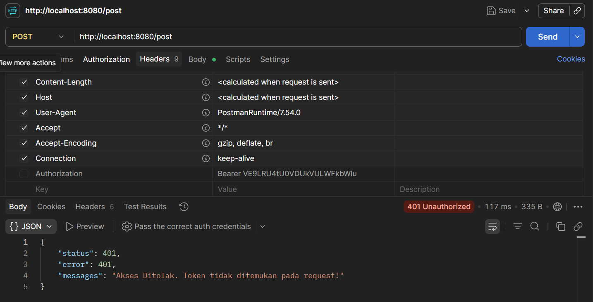
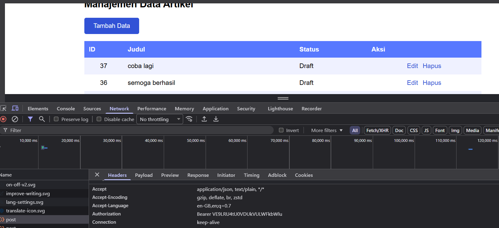
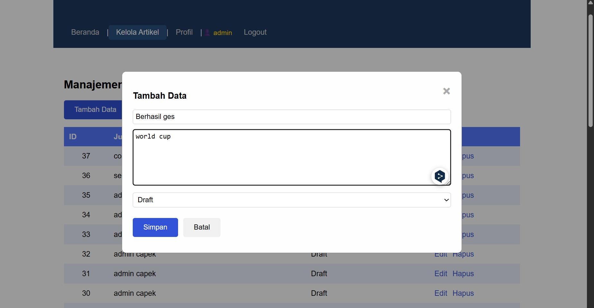
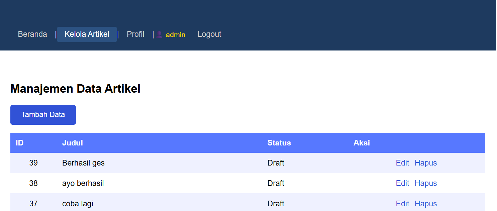
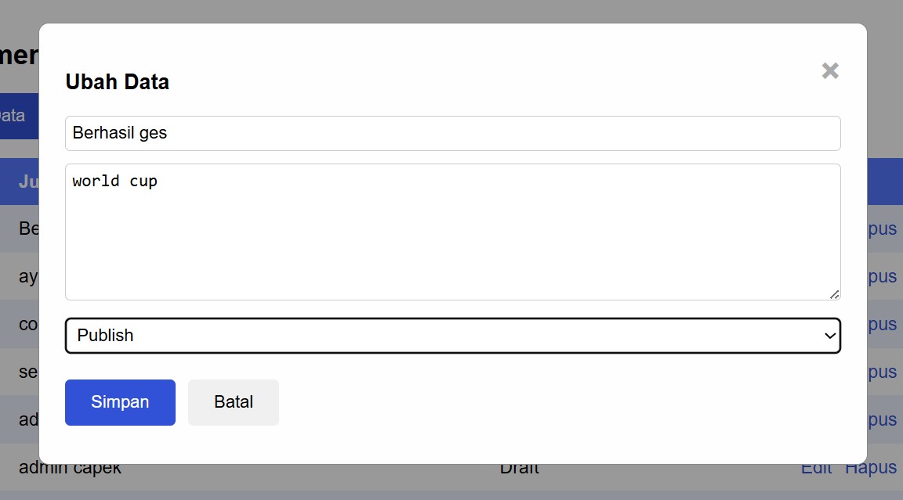
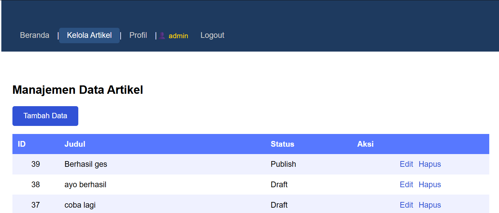
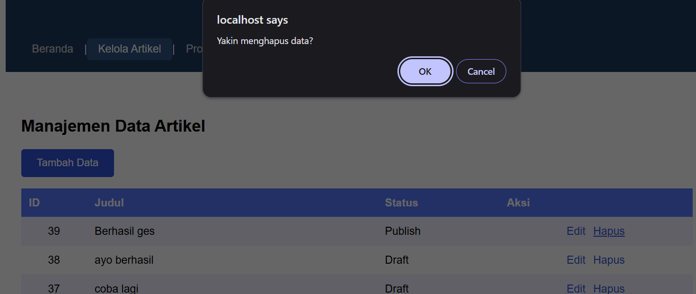
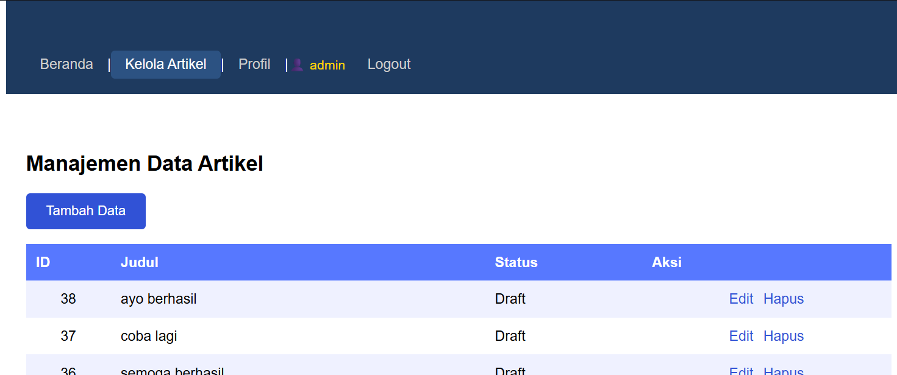

# Laporan Praktikum 14: Keamanan API, Autentikasi Token, dan Axios Interceptors

Repository ini dibuat untuk memenuhi tugas mata kuliah Pemrograman Web 2. Praktikum ini berfokus pada implementasi arsitektur keamanan menyeluruh (*End-to-End Security*) yang menghubungkan **Server-Side Security** (CodeIgniter 4 Filters dengan Token-Based Authentication) dan **Client-Side Security** (Axios Interceptors pada VueJS 3).

## Tujuan Praktikum
1. Mahasiswa mampu memahami konsep keamanan RESTful API menggunakan Token-Based Authentication.
2. Mahasiswa mampu mengimplementasikan Filters pada CodeIgniter 4 untuk mengamankan endpoint API dari akses ilegal.
3. Mahasiswa mampu memahami dan mengimplementasikan fungsi Axios Interceptors pada aplikasi Frontend VueJS.
4. Mahasiswa mampu melakukan pengujian transmisi data yang aman antara Frontend SPA dan Backend API secara *end-to-end*.

---

## Analisis Komparatif: Vue Router Guards vs CodeIgniter Filters

Dalam pengembangan aplikasi web modern berbasis *Decoupled Architecture* (Pemisahan Frontend dan Backend), terdapat perbedaan mendasar mengenai fungsi perlindungan keamanan di kedua sisi:

| Karakteristik | Vue Router Navigation Guards (Sisi Klien / Frontend) | CodeIgniter Filters (Sisi Server / Backend) |
| :--- | :--- | :--- |
| **Lokasi Eksekusi** | Berjalan di dalam web browser pengguna memanfaatkan JavaScript. | Berjalan di dalam lingkungan web server sebelum request menyentuh controller. |
| **Fungsi Utama** | Mengatur hak akses UI/Antarmuka (melindungi rute visual halaman web seperti `/artikel` atau `/about`). | Mengatur hak akses data asli di database (melindungi rute endpoint data API seperti `POST /post`, `DELETE /post/1`). |
| **Tingkat Keamanan** | **Rendah (Hanya untuk User Experience)**. Kode JavaScript di browser bisa dimanipulasi atau di-bypass oleh pengguna yang ahli melalui Developer Tools. | **Tinggi (Keamanan Inti Aplikasi)**. Tidak dapat dimanipulasi oleh klien karena server memvalidasi keaslian Token secara mutlak. |
| **Metode Proteksi** | Memeriksa nilai variabel reaktif atau status string di `localStorage`. | Memeriksa kiriman string acak unik pada HTTP Request Header (`Authorization: Bearer <token>`). |

**Kesimpulan:** Keamanan sisi klien (*Vue Router*) hanya berfungsi untuk memandu kenyamanan visual pengguna agar tidak tersesat ke halaman admin. Keamanan sejati tetap wajib berada di sisi server (*CodeIgniter Filters*) untuk memastikan data database tidak dapat ditembak atau dimanipulasi secara ilegal menggunakan tools luar seperti Postman.

---

## Langkah-Langkah Praktikum & Penjelasan Kode

### 1. Sisi Server: Membuat API Filter (`app/Filters/AuthFilter.php`)
Filter ini bertugas menghadang semua HTTP Request masuk yang mengarah ke endpoint CRUD artikel. Server akan memeriksa keberadaan token di dalam Header `Authorization`. Jika token tidak ada atau tidak valid, server langsung menolak dan mengembalikan status eror **401 Unauthorized**.

```php
<?php

namespace App\Filters;

use CodeIgniter\Filters\FilterInterface;
use CodeIgniter\HTTP\RequestInterface;
use CodeIgniter\HTTP\ResponseInterface;
use CodeIgniter\API\ResponseTrait;

class AuthFilter implements FilterInterface
{
    use ResponseTrait;

    public function beforeEach(RequestInterface $request, $arguments = null)
    {
        // 1. Mengambil token dari HTTP Header 'Authorization'
        $authHeader = $request->getServer('HTTP_AUTHORIZATION');
        
        if (!$authHeader) {
            // Jika token tidak disertakan, kirim respon penolakan akses
            $response = service('response');
            $response->setStatusCode(401);
            return $response->setJSON(['error' => 'Akses ditolak. Token tidak ditemukan.']);
        }

        // 2. Memisahkan string "Bearer <token>" untuk mengambil nilai tokennya saja
        $token = str_replace('Bearer ', '', $authHeader);

        // Contoh validasi sederhana (pada real kasus dicocokkan dengan token di DB)
        if ($token !== 'rahasia_token_ci4_anda') {
            $response = service('response');
            $response->setStatusCode(401);
            return $response->setJSON(['error' => 'Token tidak valid atau telah kedaluwarsa.']);
        }
    }

    public function afterEach(RequestInterface $request, ResponseInterface $response, $arguments = null)
    {
        // Tidak ada aksi tambahan setelah eksekusi
    }
}
```
2. Sisi Klien: Implementasi Axios Interceptors (index.html)
Di sisi Frontend VueJS, agar kita tidak perlu menuliskan kode pengiriman token secara manual di setiap fungsi fetch atau axios.get, kita menggunakan Axios Interceptors. Fitur ini bekerja secara otomatis menyisipkan token keamanan ke dalam HTTP Header setiap kali aplikasi melakukan request data ke server.

Berikut adalah konfigurasi interceptor yang diletakkan pada berkas utama index.html:
```
<script src="[https://unpkg.com/axios/dist/axios.min.js](https://unpkg.com/axios/dist/axios.min.js)"></script>

<script>
    // 1. Membuat konfigurasi global instance Axios
    const API = axios.create({
        baseURL: 'http://localhost:8080/'
    });

    // 2. Menerapkan Axios Request Interceptor
    API.interceptors.request.use(
        (config) => {
            // Ambil token string yang tersimpan di localStorage saat berhasil login
            const token = localStorage.getItem('token');
            
            if (token) {
                // Suntikkan parameter Authorization Bearer Token secara otomatis ke Header request
                config.headers['Authorization'] = `Bearer ${token}`;
            }
            
            return config;
        },
        (error) => {
            return Promise.reject(error);
        }
    );

    // 3. Menerapkan Axios Response Interceptor (Menangani Global Error 401)
    API.interceptors.response.use(
        (response) => response,
        (error) => {
            // Jika server mengembalikan respon 401 (Token Expired / Terhapus)
            if (error.response && error.response.status === 401) {
                alert('Sesi Anda telah berakhir. Silakan login kembali.');
                localStorage.removeItem('token');
                localStorage.removeItem('isLoggedIn');
                window.location.href = '#/login'; // Tendang user kembali ke form login
            }
            return Promise.reject(error);
        }
    );
</script>
```
Hasil Pengujian Keamanan (Screenshots)
1. Bukti Penolakan Akses Error 401 (Pengujian via Postman)
Berikut adalah bukti screenshot saat mencoba menembak data endpoint API http://localhost:8080/post secara langsung via Postman tanpa melampirkan string token pada Header. Server sukses memblokir request dengan status 401 Unauthorized.



2. Bukti Injeksi Otomatis Token (Tab Network Developer Tools)
Berikut adalah bukti visual dari tab Network pada Browser Developer Tools (F12). Terlihat jelas bahwa parameter Authorization: Bearer <string_token> telah berhasil disuntikkan secara otomatis dan terselubung di latar belakang sistem oleh Axios Interceptors saat memanggil data artikel.



3. Eksekusi Sukses Manipulasi Data (End-to-End Berhasil)
Berikut adalah bukti visual bahwa proses manipulasi data artikel (Tambah/Ubah/Hapus) berjalan sukses di halaman web utama karena pengiriman token di latar belakang berhasil dikenali dengan baik oleh CodeIgniter Filters.

#### Tambah





#### Edit





#### Hapus




